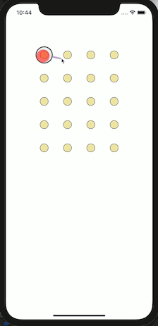
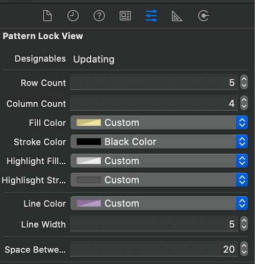

# SSPatternLock

Easy to use and configurable patternlock view for ios




# Example

To run the example project, clone the repo, and run `pod install` from the Example directory first.

# Installation

SSPatternLock is available through [CocoaPods](https://cocoapods.org). To install
it, simply add the following line to your Podfile:

```ruby
pod 'SSPatternLock'
```

You can also clone the repo and copy from swift files, which in SSPatternLock directory to your project

# Usage

Code usage; create an instance of SSPatternLockView. With SSPatternLockView config builder, you can make customizations

```swift
let patternLockView = SSPatternLockView(frame: CGRect(x: 0, y: 0, width: self.view.frame.width, height: self.view.frame.height))
        patternLockView.delegate = self
        patternLockView.config = SSPatternLockView.Config.Builder()
            .setBackgroundColor(UIColor.white)
            .setNodeFillColor(UIColor.black)
            .setNodeHighLightFillColor(UIColor.clear)
            .setNodeHighLightStrokeColor(UIColor.black)
            .setSpaceBetweenNodes(30)
            .setLineColor(UIColor.brown)
            .setLineWidth(15)
            .build()
view.addSubview(patternLockView)
```

In interface builder, add a uiview and change class to SSLockPattern. In the attributes inspector, you can change configurations




| Attribute | Type  |  Default value |
|----|---|--|
| BackgroundColor| UIColor | UIColor.clear |
| NodeFillColor | UIColor | UIColor.black |
| NodeStrokeColor | UIColor | UIColor.black |
| NodeHighLightFillColor | UIColor | UIColor.clear |
| LineColor | UIColor | UIColor.black |
| LineWidth | CGFloat | 5.0 |
| ColumnCount | Int | 4 |
| RowCount | Int | 4 |
| SpaceBetweenNodes | CGFloat | 20.0 |


For selected pattern indexes using SSPatternLockDelegate
```swift
extension ViewController : SSPatternLockDelegate {
    func patternLockSelected(_ patternLockView: SSPatternLockView, _ selectedIndexes: [Int]) {
        selectedIndexes.forEach({ print("index: \($0)") })
    }
}
```

# Author

Savaş Salihoğlu , mustafasavassalihoglu@gmail.com

# License

SSPatternLock is available under the MIT license. See the LICENSE file for more info.
